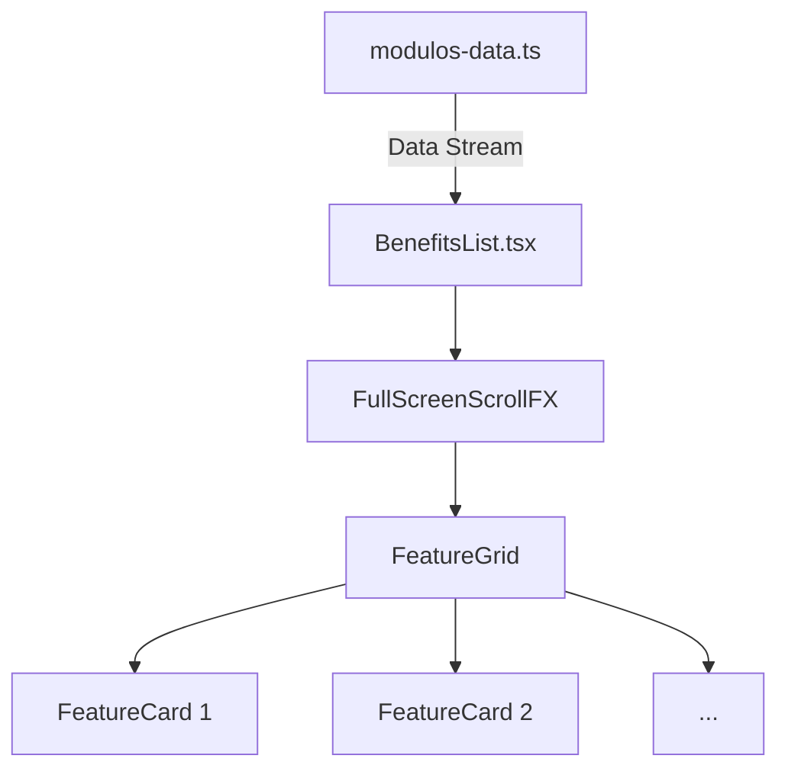

# PRP-031: BenefitsList Module Logic & Content Extraction

> **Estado**: PENDIENTE
> **Fecha**: 2026-03-30
> **Proyecto**: KIA Intelligence

---

## Objetivo

Consolidar la autoridad técnica de la landing page extrayendo toda la información de valor (Diferenciadores, Iconografía, Tags y Lógica) de la capa de datos de `/modulos` (archivo `modulos-data.ts`) e integrándola directamente en la experiencia cinematográfica de `BenefitsList.tsx`. Pasaremos de un diseño de "texto simple" a una **Matriz de Valor de Alta Densidad** dentro de cada sección de scroll.

## Por Qué

| Problema | Solución |
|----------|----------|
| Las subpáginas de módulos tienen información rica que el usuario promedio podría perderse si no hace click. | "Traer el módulo a la landing". Mostrar los diferenciadores clave (Calificación IA, Copy AIDA, CRM Sync) directamente en el scroll principal. |
| El diseño actual de `BenefitsList` es visualmente potente pero informativamente ligero. | Añadir capas de profundidad (Feature Cards) que justifiquen el posicionamiento "Elite" y "High-Ticket" del servicio. |

---

## Qué (Especificaciones Detalladas)

### 1. Extracción y Mapeo de Datos
- **Fuente**: `src/shared/lib/modulos-data.ts`.
- **Mapeo de Pilares**:
    - **Pilar 1 (Conversión)**: Extraer `modulos["landing"]`. Foco en: *Copywriting Persuasivo*, *Diseño Apple-Style*, *Glassmorphism*.
    - **Pilar 2 (Autonomía)**: Extraer `modulos["vendedor-ia"]`. Foco en: *Calificación Inteligente*, *Respuesta Instantánea*, *Memoria de Contexto*.
    - **Pilar 3 (Control)**: Extraer `modulos["dashboard"]`. Foco en: *Visibilidad Anti-Black Box*, *Métricas de ROI*, *Alertas Inteligentes*.

### 2. UI: El "Feature Matrix" (Cards)
- **Componente `FeatureCard`**: 
    - **Icón**: Soporte para `LucideIcon` dinámico según el `IconName` del data layer.
    - **Título**: Tipografía *Inter Bold*, 1.1rem.
    - **Descripción**: Texto secundario refinado, máx 2 líneas.
    - **Badge/Status**: Mostrar tags (IA, CRM, Premium) con micro-estilos de borde cian/emerald.
- **Layout**: Grid responsivo dentro de la zona central de `FullScreenScrollFX`.
    - **Desktop**: 3 columnas x 2 filas (para mostrar los 6 diferenciadores principales de cada módulo).
    - **Tablet/Mobile**: Scroll vertical o grid de 1 columna.

### 3. Sincronización Cinemática (GSAP)
- **Staggered Entrance**: Las cartas de cada sección no deben aparecer de golpe. Usaremos el timeline de GSAP para hacer una entrada escalonada (`stagger: 0.1`) de las cartas una vez que el fondo de la sección se haya estabilizado.
- **Glassmorphism**: Efecto de desenfoque de fondo (`backdrop-blur-md`) y borde semi-transparente para cada carta, asegurando legibilidad sobre las imágenes vibrantes de Unsplash.

---

## Contexto Técnico

### Arquitectura de Componentes

---

## Blueprint (Bucle Agéntico)

### FASE 1: Preparación del Componente Genérico
**Objetivo**: Habilitar `FullScreenScrollFX` para recibir contenido complejo.
**Acción**: Añadir el prop `content` a la interfaz `Section` y asegurar que el renderizado central lo incluya con su correspondiente animación de opacidad.

### FASE 2: Sistema de Cartas Premium
**Objetivo**: Crear `FeatureCard.tsx` (interno o compartido) con estilos Glassmorphism.
**Acción**: Implementar el componente y testear su look sobre fondos oscuros.

### FASE 3: Inyección y Mapeo de Negocio
**Objetivo**: Conectar `BenefitsList.tsx` con `modulos-data.ts`.
**Acción**: Mapear los 3 módulos a las 3 secciones cinematográficas. Reemplazar los textos estáticos por el loop de diferenciadores.

### FASE 4: Calibración de Stagger & Mobile
**Objetivo**: Pulir la entrada visual.
**Acción**: Ajustar el timeline de GSAP para capturar las nuevas cartas y aplicar el efecto de entrada escalonada.

---

## Gotchas
- [ ] Algunas descripciones de diferenciadores son largas. Necesitaremos un `truncate` o un `line-clamp` para mantener la simetría del grid.
- [ ] La carga de iconos Lucide debe ser optimizada para evitar duplicación de bundles.

---

*PRP pendiente aprobación por Nerickods (Experiencia Densa & Desmenuzada).*
